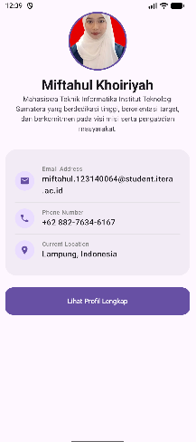
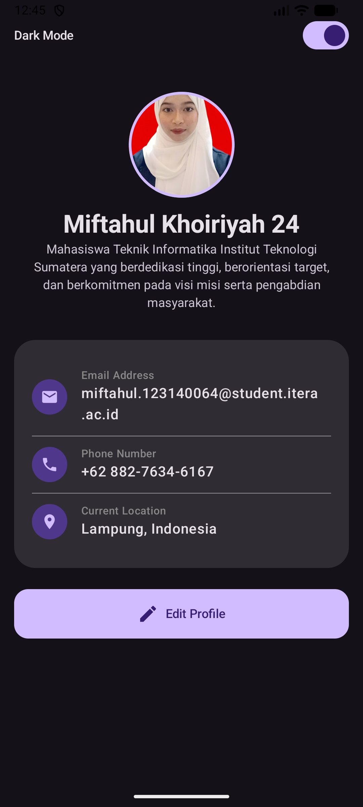
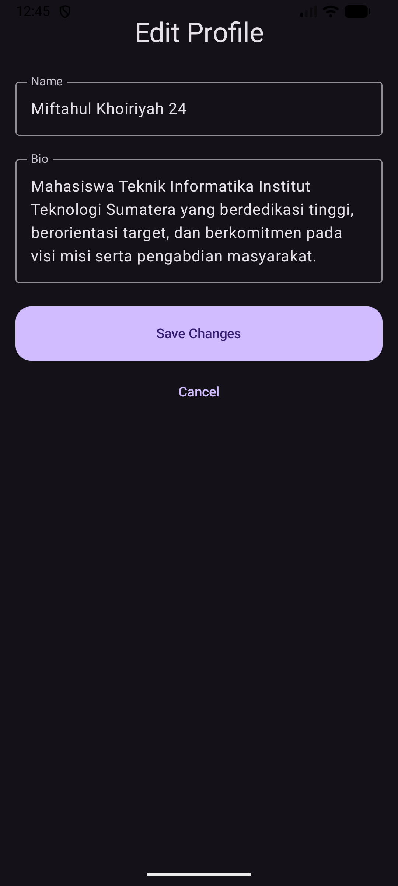

# My Profile App - Tugas Individu 3 dan 4

Aplikasi Android "My Profile App" yang dikembangkan menggunakan **Compose Multiplatform**. Aplikasi ini menampilkan informasi profil pengguna dengan kemampuan untuk mengubah data dan beralih antara tema terang (Light) dan gelap (Dark).

## ✨ Fitur Utama
1. **Halaman Profil**: Menampilkan foto profil melingkar, nama, bio, serta informasi kontak (Email, Telepon, Lokasi).
2. **Implementasi MVVM**: Pemisahan logika bisnis dan UI menggunakan `ViewModel` dan `StateFlow`.
3. **Fitur Edit Profile**: Form interaktif untuk mengubah Nama dan Bio dengan *State Hoisting*.
4. **Dark Mode Toggle**: Dukungan tema gelap yang dapat diaktifkan melalui *switch* di dalam aplikasi.
5. **Komponen Reusable**: Menggunakan komponen UI yang dapat digunakan kembali seperti `ProfileHeader`, `InfoItem`, dan `ProfileCard`.

## 📸 Screenshots
Berikut adalah tampilan aplikasi (Pastikan Anda menambahkan file gambar di folder `screenshots/` agar muncul di sini):

| Profile (Light Mode) | Profile (Dark Mode) | Edit Form |
| :---: | :---: | :---: |
|  |  |  |

## 🛠️ Teknologi yang Digunakan
- **Kotlin Multiplatform**
- **Jetpack Compose**
- **Material Design 3**
- **Kotlin Coroutines & Flow**
- **Lifecycle ViewModel**

## 📂 Struktur Folder
Proyek ini mengikuti pola arsitektur MVVM:
- `data/`: Berisi `ProfileUiState.kt` (Status Data UI).
- `viewmodel/`: Berisi `ProfileViewModel.kt` (Logika Bisnis).
- `ui/`: Berisi komponen UI reusable (`ProfileHeader`, `InfoItem`, `ProfileCard`).
- `App.kt`: Entry point utama aplikasi.

## 🚀 Cara Menjalankan
1. Clone repository ini.
2. Buka di **Android Studio Ladybug** atau versi terbaru.
3. Pastikan file `my_photo.jpg` sudah ada di `composeApp/src/commonMain/composeResources/drawable/`.
4. Jalankan pada Emulator atau Device Android.

---
**Dibuat oleh:** Miftahul Khoiriyah
